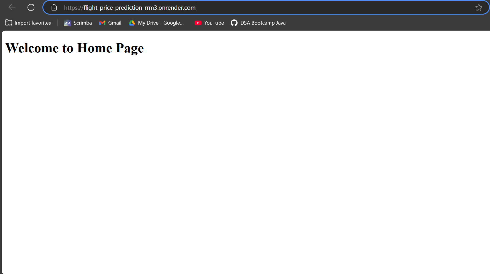
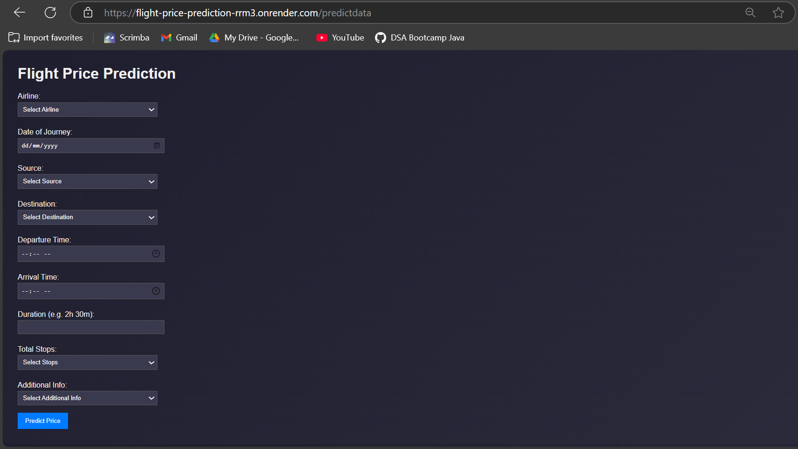
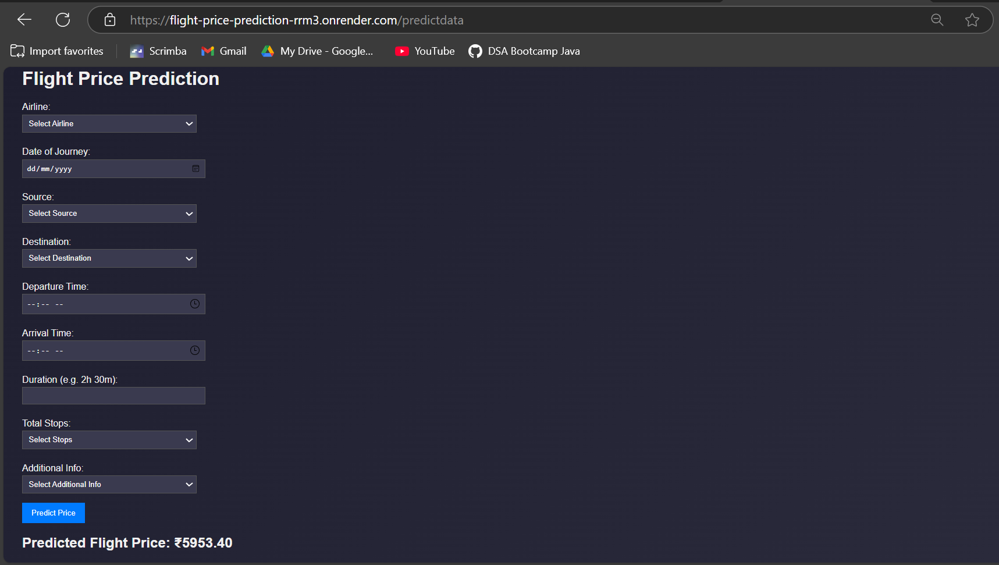

# Flight Price Prediction System

This machine learning-based system predicts flight prices by analyzing key features such as the airline, departure time, stops, and other relevant details. Users can easily input their flight information and receive an accurate predicted price, powered by advanced ML algorithms for reliable and quick predictions.


## Table of Contents

- [Overview](#overview)
- [Dataset](#dataset)
- [Deployed Website](#deployed-website)
- [Installation](#installation)
- [Usage](#usage)
- [Tech Stack](#tech-stack)
- [Future Improvements](#future-improvements)
- [Snapshots](#snapshots)


## Overview

This project builds a machine learning model to predict flight prices using features like airline, source, destination, total stops, duration, and departure/arrival time. Several algorithms were evaluated, and **XGBRegressor** (Extreme Gradient Boosting) delivered the best performance with an **R² score of 0.897** on the test set. The trained model is saved as `model.pkl` for deployment.

## Dataset

The dataset used in this project was obtained from [Kaggle's Flight Price Prediction Dataset](https://www.kaggle.com/datasets/jillanisofttech/flight-price-prediction-dataset/data?select=Data_Train.xlsx), which contains information about flight details such as:

- **Airline**: Name of the airline operating the flight.
- **Source**: Departure city.
- **Destination**: Arrival city.
- **Date_of_Journey**: The date of the flight's departure.
- **Dep_Time**: Departure time.
- **Arrival_Time**: Arrival time.
- **Duration**: Duration of the flight.
- **Total_Stops**: Number of stops (non-stop, 1 stop, etc.).
- **Price**: The target variable representing the price of the flight.

> **Data Preprocessing**:  
> The data was cleaned by handling missing values, encoding categorical variables (e.g., Airline, Source, Destination) using one-hot encoding, and extracting time-related features (e.g., Journey day/month, Dep_hour, Arrival_hour).

## Deployed Website

You can try the model live on the deployed website:

[**Flight Price Prediction App**](https://flight-price-prediction-rrm3.onrender.com)

> The website allows users to input flight details (e.g., airline, source, destination) and predict the flight price in real-time.


##  **Installation**

To set up the project locally, follow these steps:

1. **Clone the repository**

```bash
git clone https://github.com/Pragyat-Nikunj/Flight_Price_Prediction.git
```

 2. **Install the required dependencies**

```bash
pip install -r requirements.txt
```

 3. **Run the model or web app**

```bash
python app.py
```


## **Usage**


Once you have installed the required dependencies and run the `app.py` file, follow these steps to use the application:

### 1. Run the web app
Make sure your environment is set up as described in the **Installation** section. Then, run the following command:

```bash
python app.py
```

This will start the web server locally, typically on `http://localhost:5000`.

### 2. Access the prediction page
Open your browser and navigate to the following URL:

```
http://localhost:5000/predictdata
```

This page will allow you to input flight details (such as airline, source, destination, stops, etc.) to predict the flight price.

### 3. Enter the details
Fill in the required fields (e.g., airline, source, destination, stops, etc.). After entering the details, click on the **Predict** button to get the predicted flight price.

### 4. View the results
Once you submit the form, the model will process the inputs and return a predicted price for the flight. You will see the predicted price displayed on the webpage.

---

> **Note**: Make sure you have **Python 3.8** installed along with the necessary libraries listed in `requirements.txt`. The web app uses Flask to serve the prediction model.

## Tech Stack

This project leverages the following technologies and libraries:

### Backend
- **Python**: The primary programming language used for developing the model and backend.
- **Flask**: Lightweight web framework to deploy the machine learning model as a web app.
- **Gunicorn**: A WSGI HTTP server for running the Flask app in production.
  
### Machine Learning
- **Pandas**: Used for data manipulation and analysis.
- **Numpy**: Essential for numerical operations and handling arrays.
- **Scikit-learn**: For data preprocessing, model training, and evaluation.
- **CatBoost**: Gradient boosting library used for building robust models.
- **XGBoost**: An optimized gradient boosting library that achieved the best performance in this project.
- **Dill**: For serializing and saving the trained model (`model.pkl`).

### Data Visualization
- **Seaborn**: A data visualization library based on Matplotlib used for creating informative plots.
- **Matplotlib**: A comprehensive library for creating static, animated, and interactive visualizations.

### Frontend
- **HTML**: Used for structuring the web pages.
- **CSS**: Used for styling the web interface and making it user-friendly.

### File Handling
- **OpenPyXL**: A library to read and write Excel files, used for handling any data-related imports and exports.


## Future Improvements

1. **Enhance Model Accuracy**: 
   - Integrate additional features like weather data, historical price trends, and holidays to improve prediction accuracy.

2. **Use Advanced Models**: 
   - Experiment with deep learning models (e.g., neural networks) or ensemble techniques to boost performance.

3. **Scalability & Containerization**: 
   - Consider containerizing the app with **Docker** to streamline deployments and ensure scalability.


## **Snapshots**

1. **Home Page View**  
   When you first visit the application, you’ll see the main interface:  
   

2. **Feature Input**  
   Navigate to `/predictdata` and input the required flight details in the specified format:  
   

3. **Prediction Result**  
   After entering the details and clicking on *Predict*, the flight price prediction will be displayed:  
   

